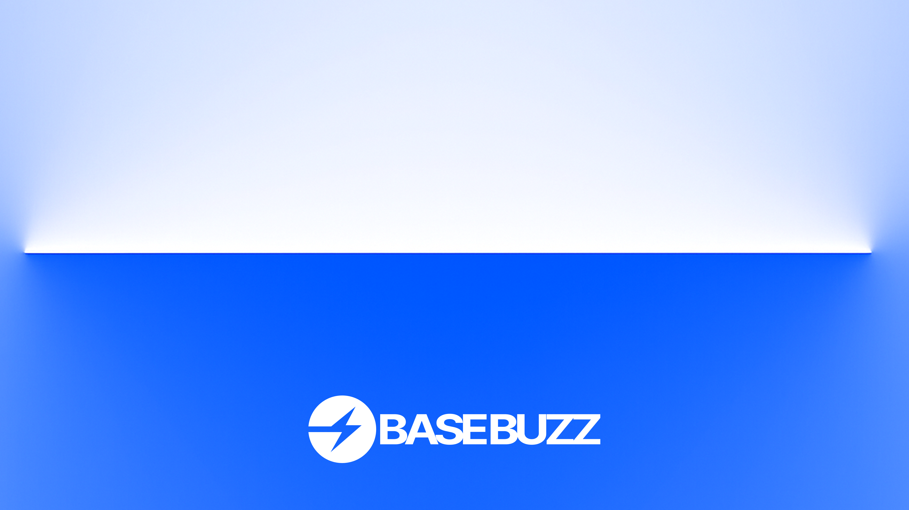

# Base Buzz brand-kit

This repo contains brand assets, style guides, and documentation for Base Buzz.

Base Buzz is the premier social platform built on Base, where content creation meets blockchain innovation. We're building the first truly decentralized social network that rewards creators, empowers communities, and makes Web3 accessible to everyone.

<!-- Badge row 1 - status -->

<!-- Badge row 2 - links and profiles -->

<!-- Badge row 3 - detailed status -->

### Guides

- [Brand Guide](guides/brand-guide.pdf)
- [Editorial Style Guide](guides/editorial-style-guide.md)
- [Platform Pitch Deck](BaseBuzz-Pitch-Deck.md)

### Developer Resources

- [Developer Portal](https://base.buzz/developer) - Main developer hub
- [API Documentation](https://base.buzz/developer/api-docs) - Interactive API docs
- [Sample Projects](https://base.buzz/developer/samples) - Code examples and templates
- [App Showcase](https://base.buzz/developer/showcase) - Live applications
- [API Keys](https://base.buzz/developer/api-key) - Authentication management

### Fonts

Located in [/fonts](fonts/).

### Logos

| Symbol                                                     | Wordmark                                                    |
| ---------------------------------------------------------- | ----------------------------------------------------------- |
|    |    |
|  |  |
|  |  |
|    |    |
