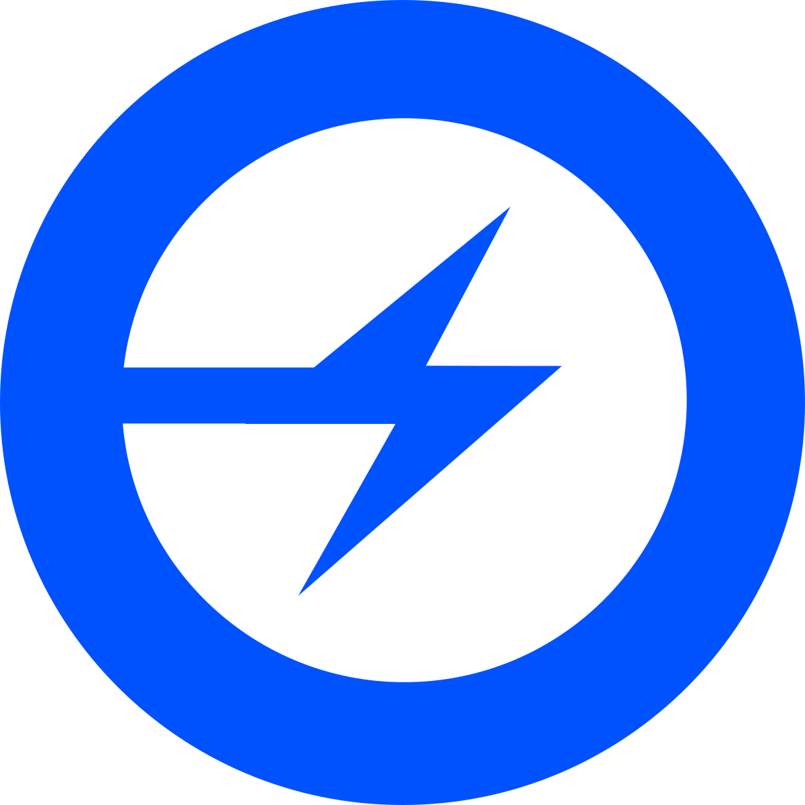
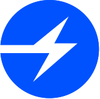
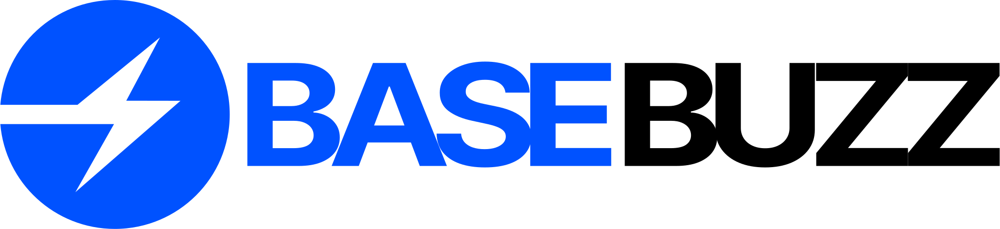
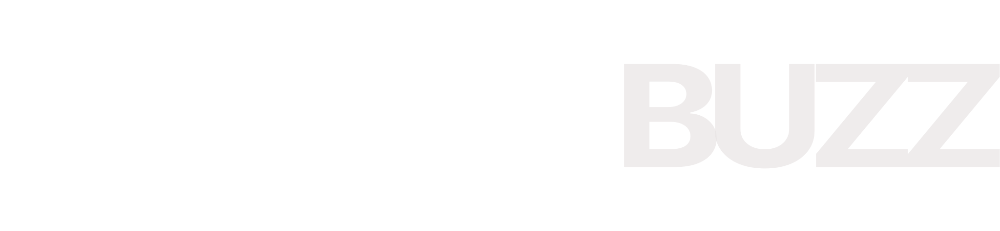
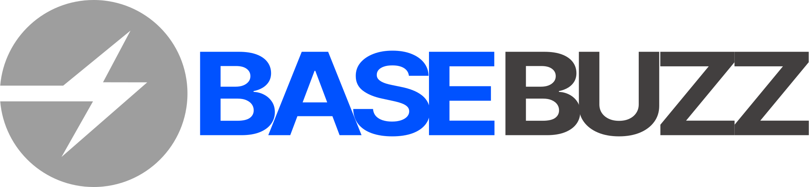

# Base Buzz brand-kit

This repo contains brand and editorial style guides for Base Buzz.

Base Buzz is a secure, low-cost, developer-friendly Ethereum L2 built to bring the next billion users onchain. It's built on Optimism's open-source [OP Stack](https://stack.optimism.io/).

<!-- Badge row 1 - status -->

<!-- Badge row 2 - links and profiles -->

<!-- Badge row 3 - detailed status -->

### Guides

- [Brand Guide](guides/brand-guide.pdf)
- [Editorial Style Guide](guides/editorial-style-guide.md)

### Fonts

Located in [/fonts](fonts/).

### Logos

| Symbol                                                     | Wordmark                                                    |
| ---------------------------------------------------------- | ----------------------------------------------------------- |
|    |    |
|  |  |
|  |  |
|    |    |
